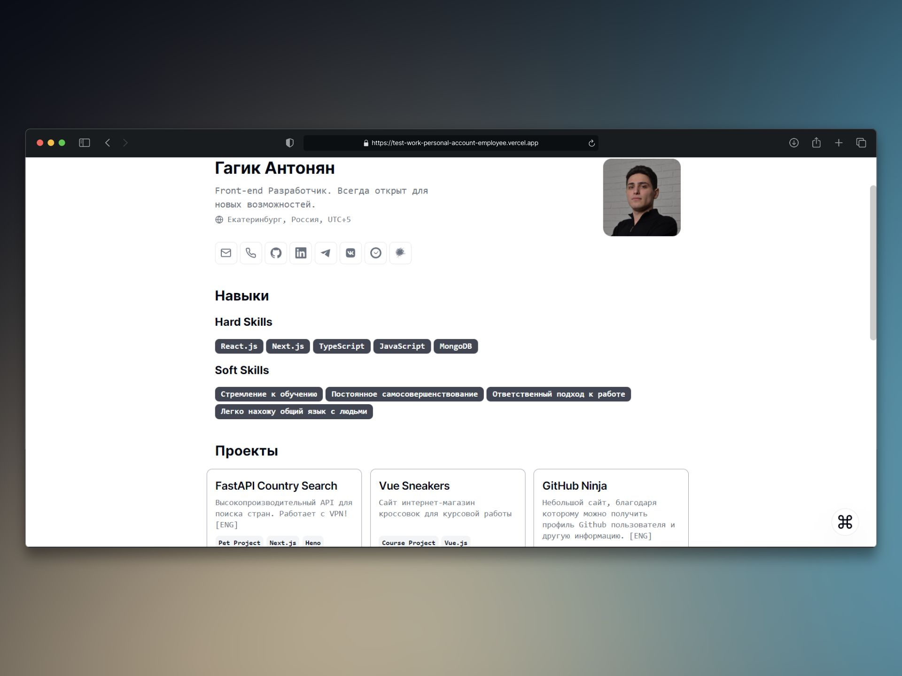

# Minimalist CV



Добро пожаловать в репозиторий моего персонального сайта-резюме. Сайт представляет собой лендинг моего резюме, где есть разделы проектов, навыков и о себе. Резюме служит важным инструментом для презентации своего потенциала и привлечения внимания потенциальных работодателей или заказчиков.


## Особенности

- Минималистический стиль;
- Установка занимает всего несколько минут;
- [Один файл конфигурации](./src/data/resume-data.tsx);
- Отзывчивый для различных устройств;
- Информация в резюме представлена ​​четко и кратко.


  ## Справочник по цвету
| Цвет             | Код цвета                                                                |
| ----------------- | ------------------------------------------------------------------ |
| Основной цвет |  #000000 |
| Вторичный цвет |  #6B7280 |
| Цвет заднего фона |  #FFFFFF |


## Стек технологий

Проект был разработан с использованием следующего стека технологий:

### Фронтенд:

- Фреймворк: [NextJs](https://nextjs.org/)
- Стилизация:
  - [TailwindCSS](https://tailwindcss.com/)
  - [ShadCN/UI](https://ui.shadcn.com/)


## Файловая структура проекта:


```
├── src
│   ├── app
         ├── layout.tsx
         └── page.tsx
│   ├── components
│   │   ├── ui
│   │   ├── command-menu.tsx
│   │   ├── orint-drawer.tsx
│   │   └── project-card.tsx
│   ├── data
│   │   └── resume-data.tsx
└── next.config.js 
 ```


# Начало работы в локальном режиме

1. Склонируйте этот репозиторий:

   ```bash
   git clone https://github.com/GoGagoo/cv.git
   ```

2. Перейдите в директорию склонированного проекта:

   ```bash
   cd cv
   ```

3. Установите зависимости:

   ```bash
   yarn install
   ```

4. Запустите приложение:

   ```bash
   yarn dev

## 🔗 Ссылки
[](https://gogagoo-portfolio.vercel.app/)
[](https://www.linkedin.com/in/gagikantonyan/)
[](https://t.me/doubleG_json)
